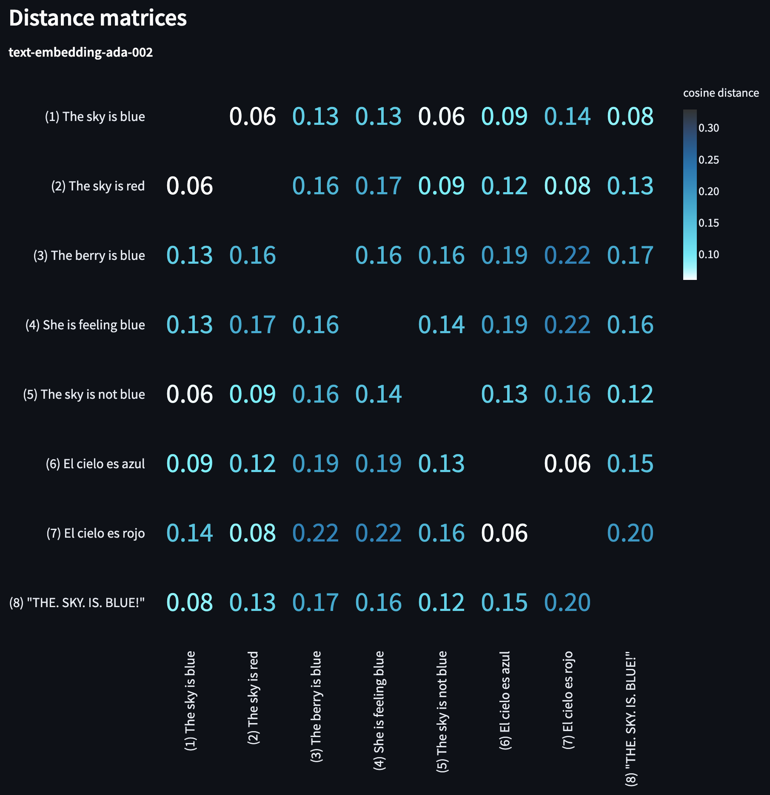

# 埋め込みプレイグラウンド

[`embeddings_playground.py`](embeddings_playground.py) は、OpenAIの埋め込みを実験するための単一ページのStreamlitアプリケーションです。

## インストール

実行する前に、必要な依存関係を以下のコマンドでインストールしてください：

```bash
pip install -r apps/embeddings-playground/requirements.txt
```

（必要に応じて、ローカルパスに一致するようにパスを変更する必要があります。）

Streamlitのインストールを確認するために、`streamlit hello` コマンドを実行してください。

## 使用方法

スクリプトを以下のコマンドで実行してください：

```bash
streamlit run apps/embeddings-playground/embeddings_playground.py
```

（再び、ローカルパスに一致するようにパスを変更する必要があります。）

アプリ内では、まず次の選択肢を選択してください：
- 距離メトリック（コサインが推奨されます）
- 埋め込みモデル（2023年5月現在、ほとんどのユースケースに対して `text-embedding-ada-002` を推奨します）

次に、比較するための任意の数の文字列を入力します。`ランク` ボタンをクリックすると、以下が表示されます：
- 最初の文字列からの距離でソートされた文字列のランク付けリスト
- 各文字列のペア間の距離を示すヒートマップ

## 例

以下は、`The sky is blue` に関連する8つの例の文字列に対する距離行列の例です：



これらの距離ペアから、次のことがわかります：
- 埋め込みは論理的な類似性よりもトピカルな類似性を測定しています（たとえば、`The sky is blue` は `The sky is not blue` に非常に近いです）
- 句読点は埋め込みに影響を与えます（例：`"THE. SKY. IS. BLUE!"` は `The sky is blue` に対して3番目に近いです）
- 同じ言語のペアは、異なる言語のペアよりも強力です（たとえば、`El cielo as azul` は `El cielo es rojo` よりも `The sky is blue` に近いです）

自分の文字列で実験して、何を学べるか試してみてください。