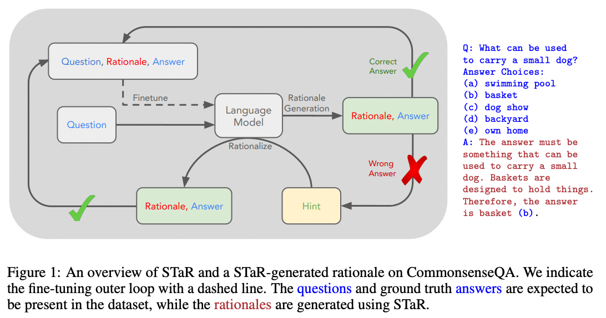
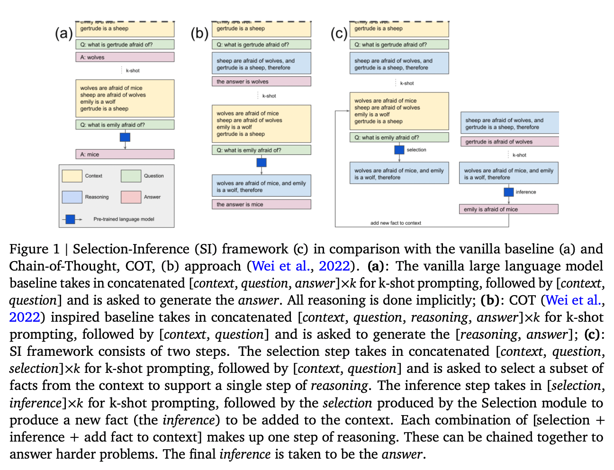
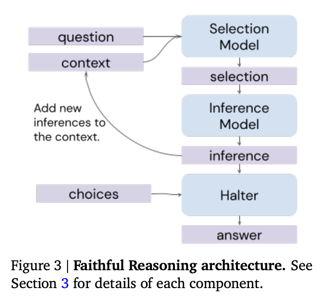
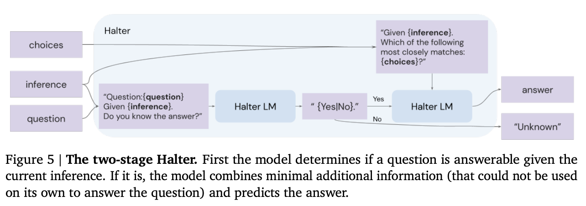
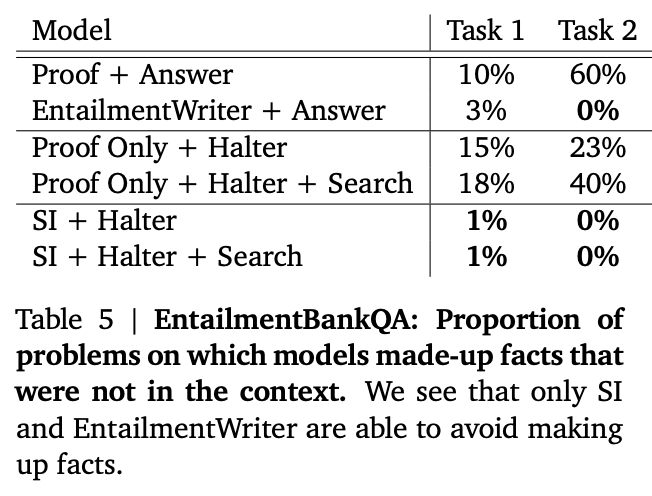

# 信頼性向上のためのテクニック

GPT-3がタスクに失敗した場合、どのようにすればよいでしょうか？

- より信頼性の高い回答を引き出すより良いプロンプトを探しますか？
- カスタムモデルを微調整するために数千の例に投資しますか？
- モデルがそのタスクに対して無力であると仮定し、次に進みますか？

簡単な答えはありません。それは状況に依存します。ただし、論理的な推論や複雑さが関与するタスクの場合、この記事で説明されているテクニックを試すことを検討して、信頼性の高いパフォーマンスを発揮するプロンプトを構築することができます。

## GPT-3が複雑なタスクで失敗する理由

もし、13を17で掛け算するように求められたら、答えがすぐに頭に浮かびますか？ほとんどの人にとっては、おそらくそうではないでしょう。しかし、これは人間が2桁の掛け算をできないことを意味するわけではありません。数秒とペンと紙があれば、13 x 17 = 130 + 70 + 21 = 221 と計算することはそれほど難しくありません。

同様に、GPT-3に時間内に次のトークンを計算する時間が足りないほど複雑なタスクを与えると、誤った推測を行う可能性があります。しかし、人間と同様に、十分な時間と空間を与えて考えることができれば、モデルは信頼性のある回答を提供できるかもしれません。

例えば、`text-davinci-002` に次の数学の問題を尋ねると、誤った回答が返ってきます：

```python
Q: ジャグラーは16個のボールを持っています。ボールの半分はゴルフボールで、その半分は青いです。青いゴルフボールは何個ありますか？
A:
```

```python
青いゴルフボールは8個です。
```

これは、GPT-3が簡単な数学の問題を解決できないことを意味するのでしょうか？いいえ。実際には、モデルに `ステップごとに考えてみましょう` というプロンプトを提示することで、モデルは問題を信頼性の高い方法で解決します：

```python
Q: ジャグラーは16個のボールを持っています。ボールの半分はゴルフボールで、その半分は青いです。青いゴルフボールは何個ありますか？
A: ステップごとに考えてみましょう。
```

```python
合計で16個のボールがあります。
ボールの半分はゴルフボールです。
つまり、ゴルフボールは8個です。
ゴルフボールの半分は青いです。
つまり、青いゴルフボールは4個です。
```

もちろん、この `ステップごとに考えてみましょう` のトリックが実際に一般的な場合に効果的なのか、単に特定の問題で偶然うまくいったのかを単一の例から判断するのは難しいです。しかし、実際には効果があります。単語の数学の問題のベンチマークでは、`ステップごとに考えてみましょう` のトリックにより、GPT-3の解決率が18％から79％に大幅に向上しました！

## モデルの能力は文脈に依存します

GPT-3を使用する際の一般的な概念的な誤解の一つは、その能力がすべての文脈で固定されていると信じることです。例えば、GPT-3が簡単な論理的な質問に誤答した場合、それは単純な論理を理解できないと考えるべきではないということです。

しかし、`ステップごとに考えてみましょう` の例が示すように、GPT-3の見かけ上の失敗は、モデルを正しい出力に導くのに役立つより適切なプロンプトで時折補正できることがあります。

## 複雑なタスクの信頼性向上方法

この記事の残りの部分では、大規模な言語モデルの複雑なタスクでの信頼性を向上させるための技術を共有します。これらの技術の一部は特定の問題タイプに特有ですが、多くは広範なタスクに

適用できる一般的な原則に基づいて構築されています。たとえば：

- より明確な指示を与える
- 複雑なタスクをより単純なサブタスクに分割する
- モデルがタスクに集中し続けるための指示を構造化する
- 回答する前にモデルに説明するようにプロンプトを設定する
- 多くの可能な回答の理由を尋ねてから統合する
- 多くの出力を生成し、その中から最良のものを選択するためにモデルを使用する
- パフォーマンスを最大化するためにカスタムモデルを微調整する

## 複雑なタスクを簡単なタスクに分割する

モデルにより多くの時間とスペースを与える一つの方法は、タスクをより単純な部分に分割することです。

例として、テキストに関する多肢選択問題をモデルに尋ねるタスクを考えてみましょう - この場合、Clue（CLU）のゲームです。直接尋ねられた場合、`text-davinci-002` はクルー 3 と 5 を組み合わせて正しく答えることができません。

```text-davinci-002
以下の手がかりを使用して、以下の多肢選択問題に回答してください。

手がかり:
1. Miss Scarlett はラウンジにいた唯一の人物でした。
2. パイプを持っていた人物はキッチンにいました。
3. Colonel Mustard は天文台にいた唯一の人物でした。
4. Professor Plum は図書室にもビリヤードルームにもいませんでした。
5. ろうそく立てを持っていた人物は天文台にいました。

質問: Colonel Mustard はろうそく立てと一緒に天文台にいましたか？
(a) はい；Colonel Mustard はろうそく立てと一緒に天文台にいました。
(b) いいえ；Colonel Mustard はろうそく立てと一緒に天文台にいませんでした。
(c) 不明；Colonel Mustard がろうそく立てと一緒に天文台にいたかどうかを判断するのに十分な情報はありません。

解答:
```

```text-davinci-002
(c) 不明；Colonel Mustard がろうそく立てと一緒に天文台にいたかどうかを判断するのに十分な情報はありません。
```

手がかり 3 と 5 は Colonel Mustard が天文台にいた唯一の人物であり、天文台にいた人物がろうそく立てを持っていたことを示しているにもかかわらず、モデルはそれらを正しい回答（a）「はい」に結びつけることができません。

しかし、直接回答を求める代わりに、このタスクを三つの部分に分割できます：

- 最初に、手がかりを1つずつ確認し、その手がかりが関連する可能性があるかどうかを考える。
- 次に、関連する手がかりを組み合わせて質問の回答を推論する。
- 最後に、最終的な回答（a、b、またはc）を書く。

```text-davinci-002
以下の手がかりを使用して、以下の多肢選択問題に回答する手順を使用してください：
(1) 最初に、手がかりを1つずつ確認し、その手がかりが関連する可能性があるかどうかを考えます。
(2) 次に、関連する手がかりを組み合わせて質問の回答を推論します。
(3) 最後に、回答を多肢選択の回答（a、b、またはc）にマップします。

手がかり:
1. Miss Scarlett はラウンジにいた唯一の人物でした。
2. パイプを持っていた人物はキッチンにいました。
3. Colonel Mustard は天文台にいた唯一の人物でした。
4. Professor Plum は図書室にもビリヤードルームにもいませんでした。
5. ろうそく立てを持っていた人物は天文台にいました。

質問: Colonel Mustard はろうそく立てと一緒に天文台にいましたか？
(a) はい；Colonel Mustard はろうそく立てと一緒に天文台にいました。
(b) いいえ；Colonel Mustard はろうそく立てと一緒に天文台にいませんでした。
(c) 不明；Colonel Mustard がろうそく立てと一緒に天文台にいたかどうかを判断するのに十分な情報はありません。

解答:
(1) 最初に、手がかりを1つずつ確認し、その手がかりが関連する可能性があるかどうかを考えます：
```

```text-davinci-002
手がかり 1: Miss Scarlett はラウンジにいた唯一の人物でした。この手がかりは関連ありません。
手がかり 2: パイプを持っていた人物はキッチンにいました。この手がかりは関連ありません。
手がかり 3: Colonel Mustard は天文台にいた唯一の人物でした。この手がかりは関連します。
手がかり 4: Professor Plum は図書室にもビリヤードルームにもいませんでした。この手がかりは関連ありません。
手がかり 5: ろうそく立てを持っていた人物は天文台にいました。この手がかりは関連します。

(2) 次に、関連する手がかりを組み合わせて質

問の回答を推論します：
手がかり 3 と手がかり 5 の両方が、ろうそく立てを持っていた人物が天文台にいたことを示しています。Colonel Mustard は天文台にいた唯一の人物であり、したがって Colonel Mustard がろうそく立てを持っていた人物であったと結論できます。

(3) 最後に、最終的な回答を書きます：
(a) はい；Colonel Mustard はろうそく立てと一緒に天文台にいました。
```

モデルに考えるためのより多くの時間とスペースを与え、推論プランに従って案内することで、正しい回答である（a）「はい」を正確に求めることができます。

複雑な指示をより小さなサブタスクに分割する利点のもう一つは、モデルを各サブタスクに集中させるのに役立つことです。

例えば、`text-davinci-002` にテキストをその元の言語で要約させるように尋ねた場合、モデルは英語に戻ってしまうことがあります：

```text-davinci-002
テキストの元の言語を使用してテキストを要約してください。要約は1文である必要があります。

テキスト:
"""
La estadística（ドイツ語の Statistik から派生した女性形のスペイン語用語、さらにイタリア語の statista から派生）は、データの変動性、収集、整理、分析、解釈、および提示、および確率の法則に従ってそれらを生成するランダムプロセスを研究する科学です。統計学は、公式な帰納的科学であり、形式的な科学的方法を通じて得られた自己の知識であり、ダイナミックで持続的に発展しています。時折、自然科学は、実験と観察に基づく新しい知識を得るために、事実の研究プロセス中に統計的手法を使用する必要があります。これらの場合、統計の適用により、ランダムまたは条件付きで発生する物理的または自然現象の相関と依存関係を説明しようとする、代表的なサンプルからのデータの分析が可能になります。
"""

要約:
```

```text-davinci-002
テキストは、統計学がデータの変動性、収集、整理、分析、解釈、および提示、および確率の法則に従ってそれらを生成するランダムプロセスを研究する科学であることを説明しています。
```

ただし、最初にテキストの言語を識別し、その後テキストを要約するようにモデルに尋ねると、信頼性が高まります：

```text-davinci-002
まず、テキストの言語を識別してください。次に、テキストをその元の言語で要約してください。要約は1文である必要があります。

テキスト:
"""
La estadística（ドイツ語の Statistik から派生した女性形のスペイン語用語、さらにイタリア語の statista から派生）は、データの変動性、収集、整理、分析、解釈、および提示、および確率の法則に従ってそれらを生成するランダムプロセスを研究する科学です。統計学は、公式な帰納的科学であり、形式的な科学的方法を通じて得られた自己の知識であり、ダイナミックで持続的に発展しています。時折、自然科学は、実験と観察に基づく新しい知識を得るために、事実の研究プロセス中に統計的手法を使用する必要があります。これらの場合、統計の適用により、ランダムまたは条件付きで発生する物理的または自然現象の相関と依存関係を説明しようとする、代表的なサンプルからのデータの分析が可能になります。
"""

言語:
```

```text-davinci-002
スペイン語

統計学はデータの変動性、収集、整理、分析、解釈、および提示、および確率の法則に従ってそれらを生成するランダムプロセスを研究する科学であることを説明しています。
```
以下は、モデルが回答する前に説明を求めるための効果的なテクニックの一つです。最終的な答えにすぐに飛び込む代わりに、モデルに徐々に答えを理論的に考え出させるように求めることで、回答の信頼性を向上させる強力なテクニックです。モデルが「声に出して考える」ことにより、正しい答えに到達する可能性が格段に高くなります。

### ゼロショット

#### 方法

[Takeshi Kojimaらによって2022年に発表](https://arxiv.org/abs/2205.11916)された方法によれば、モデルに答えを理論的に考え出させるための最も簡単な方法は、単に答えを「ステップバイステップで考えてみましょう。」というフレーズで前置することです。図2はその例を示しています：

[
<br>出典：Takeshi Kojimaらによる「Large Language Models are Zero-Shot Reasoners」（2022）](https://arxiv.org/abs/2205.11916)

#### 結果

この単純なトリックをMultiArith数学データセットに適用した結果、著者らは「ステップバイステップで考えてみましょう。」を使うことで、正解率が18％から79％に四倍に増加したことがわかりました！

[
<br>出典：Takeshi Kojimaらによる「Large Language Models are Zero-Shot Reasoners」（2022）](https://arxiv.org/abs/2205.11916)

#### 影響

「ステップバイステップで考えてみましょう。」のトリックは数学の問題にはうまく機能しますが、すべてのタスクで有効ではありません。著者らは、これが多段階の算術問題、象徴的な推論問題、戦略問題、およびその他の推論問題に最も役立つことを発見しました。それは単純な数学の問題や常識的な問題には役立たず、おそらく他の非推論のタスクにも役立たないでしょう。

[
<br>出典：Takeshi Kojimaらによる「Large Language Models are Zero-Shot Reasoners」（2022）](https://arxiv.org/abs/2205.11916)

詳細については、[フルペーパー](https://arxiv.org/abs/2205.11916)をご覧ください。

このテクニックを自分のタスクに適用する場合、指示をカスタマイズして実験することを躊躇しないでください。「ステップバイステップで考えてみましょう。」はかなり一般的な指示ですので、ユースケースに合わせてより厳格なフォーマットに合わせた指示でより良いパフォーマンスを得ることができるかもしれません。例えば、次のような構造化されたバリエーションを試すことができます。「まず、なぜXが正しいと思われるかをステップバイステップで考えてみてください。次に、なぜYが正しいと思われるかをステップバイステップで考えてみてください。最後に、XまたはYのどちらがより理にかなっているかをステップバイステップで考えてみてください。」。そして、モデルにトラックを保つのを助けるための例のフォーマットも与えることができます。

```text-davinci-002
以下のIRSのガイダンスを使用して、次の質問にこのフォーマットで回答してください：
(1) 各基準について、車両購入が該当するかどうかを判断してください
- {基準} ステップバイステップで考えてみましょう。 {説明} {はいまたはいいえ、または該当しない場合はN/A}。
(2) 各基準を順番に検討した後、最終的な回答を次のようにフレーズ化してください。「{理由}のため、回答はおそらく{はいまたはいいえ}です。」

IRSのガイダンス：
"""
以下の基準を満たす車両を購入した場合、セクション30Dに基づく連邦税控除の対象となる場合があります。
- 車両は少なくとも4つの車輪を持っていますか？
- 車両の重量は14,000ポンド未満ですか？
- 車両は外部から充電できる少なくと

も4キロワット時のバッテリーからエネルギーを供給しますか？
- 車両は2022年以前に購入されましたか？
  - そうであれば、メーカーは200,000台未満の対象車両を販売しましたか？（TeslaとGMは200,000台以上の対象車両を販売しました。）
- 車両は2022年以降に購入されましたか？
  - そうであれば、車両は次の北米組立車両リストに含まれていますか？（北米で組み立てられた唯一の電動車両は、Audi Q5、BMW 330e、BMW X5、Chevrolet Bolt EUV、Chevrolet Bolt EV、Chrysler Pacifica PHEV、Ford Escape PHEV、Ford F Series、Ford Mustang MACH E、Ford Transit Van、GMC Hummer Pickup、GMC Hummer SUV、Jeep Grand Cherokee PHEV、Jeep Wrangler PHEV、Lincoln Aviator PHEV、Lincoln Corsair Plug-in、Lucid Air、Nissan Leaf、Rivian EDV、Rivian R1S、Rivian R1T、Tesla Model 3、Tesla Model S、Tesla Model X、Tesla Model Y、Volvo S60、BMW 330e、Bolt EV、Cadillac Lyriq、Mercedes EQS SUV、およびNissan Leafです。）
"""

質問：2021年に購入したトヨタ・プリウスプライムに対して連邦税控除を申請できますか？

解決策：

(1) 各基準について、車両購入が該当するかどうかを判断してください
- 車両は少なくとも4つの車輪を持っていますか？ ステップバイステップで考えてみましょう。
```

```text-davinci-002
 トヨタ・プリウスプライムは4つの車輪を持っているので、答えは「はい」です。
- 車両の重量は14,000ポンド未満ですか？ ステップバイステップで考えてみましょう。 トヨタ・プリウスプライムの重量は14,000ポンド未満ですので、答えは「はい」です。
- 車両は外部から充電できる少なくとも4キロワット時のバッテリーからエネルギーを供給しますか？ ステップバイステップで考えてみましょう。 トヨタ・プリウスプライムは外部から充電できる少なくとも4キロワット時のバッテリーからエネルギーを供給しますので、答えは「はい」です。
- 車両は2022年以前に購入されましたか？ ステップバイステップで考えてみましょう。 トヨタ・プリウスプライムは2021年に購入されました、これは2022年より前ですので、答えは「はい」です。
- 車両は2022年以降に購入されましたか？ N/A
- そうであれば、車両は次の北米組立車両リストに含まれていますか？ N/A

(2) 各基準を順番に検討した後、最終的な回答を次のようにフレーズ化してください。「トヨタ・プリウスプライムはすべての基準を満たしているため、答えはおそらく「はい」です。」
```

### フューショットの例

#### 方法

モデルに回答を理論的に考え出すように促す方法はさまざまです。その一つは、いくつかの例を示すこと（'フューショット'）で、[GoogleのJason WeiとDenny Zhouらが研究](https://ai.googleblog.com/2022/05/language-models-perform-reasoning-via.html)した方法です。以下は例のチェーン・オブ・ソートのプロンプトの一例です：

[
<br>出典：Jason WeiとDenny Zhouらによる「Chain of Thought Prompting Elicits Reasoning in Large Language Models」（2022）](https://ai.googleblog.com/2022/05/language-models-perform-reasoning-via.html)

人間のラベラーによって書かれた理論的なチェーンのデモンストレーションもあります：

[
<br>出典：Jason WeiとDenny Zhouらによる「Chain of Thought Prompting Elicits Reasoning in Large Language Models」（2022）](https://ai.googleblog.com/2022/05/language-models-perform-reasoning-via.html)

（なお、実際には梨が浮かぶかどうかについては疑問が呈されています）

#### 結果

小学校の数学の問題に対するテストでは、著者らはチェーン・オブ・ソートのプロンプトが解決率を3倍に引き上げ、18％から57％に向上させることがわかりました。

[
<br>出典：Jason WeiとDenny Zhouらによる「Chain of Thought Prompting Elicits Reasoning in Large Language Models」（2022）](https://ai.googleblog.com/2022/05/language-models-perform-reasoning-via.html)

数学の問題に加えて、チェーン・オブ・ソートのプロンプトはスポーツ理解に関連する質問、コイントスの追跡、および最後の文字の連結に関連する質問のパフォーマンスも向上させました。ほとんどの場合、パフォーマンスの向上には多くの例が必要ではありませんでした（約8つ以下）。

[
<br>出典：Jason WeiとDenny Zhouらによる「Chain of Thought Prompting Elicits Reasoning in Large Language Models」（2022）](https://ai.googleblog.com/2022/05/language-models-perform-reasoning-via.html)

詳細については、[フルペーパー](https://arxiv.org/abs/2201.11903)をご覧ください。
#### 含意

`Let's think step by step` テクニックに比べて、few-shot example-based アプローチの利点の一つは、モデルに最終的な回答に到達する前に、モデルが実行するフォーマット、長さ、および推論のスタイルをより簡単に指定できることです。モデルが最初に適切な方法や深さで推論していない場合、これは特に役立ちます。

### ファインチューニング

#### メソッド

一般的に、タスクの最大のパフォーマンスを引き出すには、カスタムモデルをファインチューニングする必要があります。ただし、説明を使用してモデルをファインチューニングするには、数千の説明例が必要であり、書くのに費用がかかります。

2022年、Eric ZelikmanとYuhuai Wuらは、few-shotプロンプトを使用して説明のデータセットを生成し、モデルをファインチューニングする賢明な手順を発表しました。アイデアは、few-shotプロンプトを使用して候補の説明を生成し、正しい回答を生成する説明のみを保持することです。その後、誤った回答のいくつかに追加の説明を取得するために、正しい回答を質問の一部として提供してfew-shotプロンプトを再試行することです。著者はこの手順をSTaR（セルフトートリーズリーソナー）と呼びました。

[
<br>出典: Eric ZelikmanおよびYuhuai Wuらによる「STaR: Bootstrapping Reasoning With Reasoning」（2022）](https://arxiv.org/abs/2203.14465)

このテクニックを使用すると、数千の説明例を書く必要なく、ファインチューニングの利点と思考の連鎖プロンプティングの利点を組み合わせることができます。

#### 結果

著者がこのテクニックをCommon Sense Q&Aデータセットに適用したところ、STaRはチェーンオブソートプロンプト単独（73％ > 37％）およびファインチューニング単独（73％ > 60％）を上回ることがわかりました。

[
<br>出典: Eric ZelikmanおよびYuhuai Wuらによる「STaR: Bootstrapping Reasoning With Reasoning」（2022）](https://arxiv.org/abs/2203.14465)

詳細については、[フルペーパー](https://arxiv.org/abs/2203.14465)を読んでください。

#### 含意

few-shotプロンプトを使用してファインチューニングデータセットを拡張または変更するアイデアは、説明の書き込み以外にも一般化できるアイデアです。たとえば、訓練したい大量の非構造化テキストがある場合、プロンプトを使用して非構造化テキストから構造化データセットを抽出し、その構造化データセットでカスタムモデルをファインチューニングする機会があるかもしれません。

## チェーンオブソートプロンプティングの拡張

チェーンオブソートプロンプティングの拡張もいくつか発表されています。

### 選択推論プロンプティング

#### メソッド

Antonia Creswellらによって発表されたチェーンオブソートテクニックの拡張の1つは、説明と回答を生成するための単一のプロンプトをより小さな部分に分割することです。最初に、プロンプトはテキストから関連する事実のサブセットを選択します（'選択プロンプト'）。その後、2番目のプロンプトは選択した事実から結論を推論します（'推論プロンプト'）。これらのプロンプトはループ内で交互に使用され、複数の推論ステップを生成し、最終的な回答に到達します。著者はこのアイデアを以下の図で示しています：

[
<br>出典: Antonia Creswellらによる「Selection-Inference: Exploiting Large Language Models for Interpretable Logical Reasoning」（2022）](https://arxiv.org/abs/2205.09712)

#### 結果

著者が7Bパラメータモデルに適用した結果、選択推論プロンプティングは、長い推論ステップが必要なbAbiおよびProof Writerベンチマークタスクにおいて、チェーンオブソートプロンプティングに比べてパフォーマンスが

大幅に向上しました。彼らが達成した最高のパフォーマンスは、選択推論プロンプティングとファインチューニングを組み合わせた場合でした。

[
<br>出典: Antonia Creswellらによる「Selection-Inference: Exploiting Large Language Models for Interpretable Logical Reasoning」（2022）](https://arxiv.org/abs/2205.09712)

#### 含意

これらのベンチマークの利益は大きかったものの、これらのベンチマークは長い推論ステップが必要であるため特に選ばれました。多くのステップを必要としない問題では、利益はおそらく小さいでしょう。

結果は、大きな言語モデルを扱う際のいくつかの一般的な教訓を示しています。一つは、複雑なタスクを小さなタスクに分割することは、信頼性とパフォーマンスを向上させる素晴らしい方法です。タスクが原子的であれば、モデルがエラーを起こす余地が少なくなります。二つ目は、最大のパフォーマンスを得るためには、選択したアプローチにファインチューニングを組み合わせることが多いということです。

詳細については、[フルペーパー](https://arxiv.org/abs/2205.09712)を読んでください。

### 信頼性のある推論アーキテクチャ

チェーンオブソートプロンプティングテクニックを発表した数か月後、著者らはそのテクニックを拡張するフォローアップペーパーを発表し、以下のアイデアを提供しました：

- 選択推論サイクルを停止または継続するタイミングを特定する
- 複数の推論経路を検索するのに役立つ価値関数を追加
- モデルが文自体を書き出す代わりに文のラベル（たとえば、sen1）を理解するようにファインチューニングすることで、偽の事実の幻想を減少させる

#### メソッド

オリジナルの選択推論テクニックでは、専門の「選択」および「推論」プロンプトが選択した事実を選択し、それらの事実から推論を行い、推論ステップのシーケンスを生成するために交互に使用されます。

著者はこのテクニックに2つの追加コンポーネントを追加します。

まず、著者は、各推論ステップの後に、これまでの推論が質問に回答するのに十分かどうかを尋ねる「停止器」モデルを追加します。はいの場合、モデルは最終的な回答を生成します。

停止モデルはいくつかの利点をもたらします：

- 必要に応じて選択推論プロセスに停止または継続するよう指示できます。
- プロセスが停止しない場合、回答は得られませんが、これはしばしば幻想の推測よりも望ましいことです。

[
<br>出典: Antonia Creswellらによる「Faithful Reasoning Using Large Language Models」（2022）](https://arxiv.org/abs/2208.14271)

[
<br>出典: Antonia Creswellらによる「Faithful Reasoning Using Large Language Models」（2022）](https://arxiv.org/abs/2208.14271)

次に、著者は推論ステップの品質を評価し、複数の推論経路を検索するために使用される価値関数を追加します。これは信頼性を向上させるための共通のテーマを反映しています。モデルから単一の回答を生成するのではなく、いくつかの回答を生成し、その中から最良の回答を選ぶためのいくつかの種類の価値関数/ディスクリミネータ/検証モデルを使用します。

[
<br>出典: Antonia Creswellらによる「Faithful Reasoning Using Large Language Models」（2022）](https://arxiv.org/abs/2208.14271)

これらの2つの拡張に加えて、著者は偽の事実の幻想を減少させるトリックを使用します。モデルに事実の文を書き出す代わりに、文のラベル（sen1など）で作業するようにファインチューニングすることで、モデルがプロンプトコンテキストに含

まれていない偽の事実を幻想するのを防ぎます。

[
<br>出典: Antonia Creswellらによる「Faithful Reasoning Using Large Language Models」（2022）](https://arxiv.org/abs/2208.14271)

#### 結果

著者は2つのベンチマークでそのテクニックを評価しました：ProofWriterタスク（非表示）と[EntailmentBankQA](https://allenai.org/data/entailmentbank)（表示）。このテクニックは、特に難しい推論問題に対して、正確性を大幅に向上させました。


<br>出典: Antonia Creswellらによる「Faithful Reasoning Using Large Language Models」（2022）](https://arxiv.org/abs/2208.14271)

さらに、文のラベル操作のトリックは、幻想を実質的に排除しました！


<br>出典: Antonia Creswellらによる「Faithful Reasoning Using Large Language Models」（2022）](https://arxiv.org/abs/2208.14271)

#### 含意

この論文は、大きな言語モデルの信頼性を向上させるためのいくつかの役立つ教訓を示しています：

- 複雑なタスクを小さな、信頼性のあるサブタスクに分割する
- 回答を段階的に生成し、その途中で評価する
- 多くの可能な回答を生成し、最適なものを選ぶために別のモデルまたは関数を使用する
- モデルが言えることを制約することで幻想を減少させる（文自体ではなく文のラベルを使用）
- カスタムタスクでモデルのパフォーマンスを最大化するために、ファインチューニングを行う

詳細については、[フルペーパー](https://arxiv.org/abs/2208.14271)を読んでください。

### 最小から最大へのプロンプティング

チェーンオブソートプロンプティングは、長い推論チェーンが必要な場合には特に苦労することがありますが、例が短くてもタスクが長い場合に特に苦労することがあります。

#### メソッド

最小から最大へのプロンプティングは、推論タスクを小さな、信頼性のあるサブタスクに分割する別のテクニックです。アイデアは、モデルにサブタスクを提示し、例えば「{質問}を解決するには、まず次を解決する必要があります：」のようなものでプロンプトすることで、モデルにサブタスクを引き出すことです。そのサブタスクを手に入れたら、モデルは解決策を生成できます。解決策は元の質問に追加され、プロセスは最終的な回答が生成されるまで繰り返されます。

[
<br>出典: Denny Zhouらによる「Least-to-most Prompting Enables Complex Reasoning in Large Language Models」（2022）](https://arxiv.org/abs/2205.10625)

#### 結果

最後の文字連結タスクを使用した最小から最大へのプロンプティングの結果、`code-davinci-002`を使用して長い推論チェーンが必要なベンチマークで、16％ -> 99.7％という大きな利益が計測されました！

[


<br>出典: Denny Zhouらによる「Least-to-most Prompting Enables Complex Reasoning in Large Language Models」（2022）](https://arxiv.org/abs/2205.10625)

#### 含意

上記の最小から最大へのプロンプティングによる利益は印象的ですが、非常に狭い範囲のタスクで測定されており、長い推論チェーンが必要です。

それにもかかわらず、これは共通のテーマを示しています：（a）複雑なタスクを小さなサブタスクに分割し、（b）モデルに回答を出すための時間とスペースを与えることで信頼性を向上させる。## 関連するアイデア

### マイエウティック・プロンプティング

#### 方法

従来のアプローチとは対照的に、正しい回答の尤度を最大化しようとする他のテクニックとは異なり、GPT-3を使用して可能な説明（正しいものと正しくないものの両方）のツリーを生成し、それらの関係を分析して正しいセットを推測する方法があります。このテクニックは、2022年5月に[Jaehun Jungらによって提唱された](https://arxiv.org/abs/2205.11822)もので、このテクニックは質問を引き出すためのソクラテスの質問法に関連する意味を持つ「マイエウティック・プロンプティング」と名付けられました。

この方法は複雑で、次のように機能します：

- まず、マイエウティック・ツリーを構築します。各ノードは真偽可能な文です：
  - 多肢選択の質問または真偽の文（例：`戦争には引き分けはありえない`）
  - 質問への各可能な回答に対して、モデルを使用して対応する説明を生成します（プロンプト例：`戦争には引き分けはありえない？ 真実、なぜなら`）
  - 次に、モデルに質問と生成された説明を提示し、答えを生成するように要求します。説明を逆にすることが（プレフィックスとして`{説明}と言うのは間違っている`のように）答えを逆転させる場合、説明は「論理的に統合的」と見なされます。
  - 説明が論理的に統合的でない場合、上記のプロセスを再帰的に繰り返し、各説明を真偽の質問に変換し、新しい質問ごとにさらに説明を生成します。
  - すべての再帰的な説明が完了すると、説明を含むツリーが得られ、ツリー上の各葉が説明を逆にするとモデルの答えも逆転するという特性を持っています。
- その後、ツリーを関係のグラフに変換します：
  - ツリー内の各ノードについて、各ノードへのモデルの相対的な信念を計算します（説明を与えたときに「真」の答えを得る確率から推定）
  - ツリー内の各ノードのペアについて、モデルを使用してそれらが含意（暗示）されるか否かを識別します。
- 最後に、最も一貫性のある信念のセットを見つけ、それらを真と見なします：
  - 具体的には、各ノードの信念の強さとそれらの間の論理的な関係を使用して、問題を重み付け最大充足問題（MAX-SAT）として定式化します。
  - ソルバーを使用して最も自己整合性のある信念のセットを見つけ、それらを真として採用します。

[
  
<br>出典：Jaehun Jungらによる「マイエウティック・プロンプティング: 再帰的説明による論理的に整合性のある推論」（2022年）](https://arxiv.org/abs/2205.11822)


#### 結果

[
<br>出典：Jaehun Jungらによる「マイエウティック・プロンプティング: 再帰的説明による論理的に整合性のある推論」（2022年）](https://arxiv.org/abs/2205.11822)

#### 影響

この方法の複雑さ以外にも、この方法の制限の1つは、これが多肢選択として提示できる質問にのみ適用できるように見えることです。

詳細については、[フルペーパー](https://arxiv.org/abs/2205.11822)をお読みいただくことをお勧めします。

## 拡張

### 自己整合性

#### 方法

離散的な回答のセットを持つタスクの場合、信頼性を向上させる1つの簡単な方法は、モデルから複数の説明と回答をサンプリング（正の温度を使用）し、最も頻繁に現れる最終的な回答を選択することです。

[
<br>出典：Xuezhi Wangらによ

る「自己整合性は言語モデルの思考連鎖推論を向上させます」（2022年）](https://arxiv.org/abs/2203.11171)

#### 結果

このテクニックは、数学と推論の一連のベンチマークで、正確さを1から24ポイント向上させました。 （下のグラフはGoogleのLaMDAモデルの結果です。Googleの大きなPaLMモデルを使用すると、ベースラインは高くなりますが、利益は若干小さくなります。）

[
<br>出典：Xuezhi Wangらによる「自己整合性は言語モデルの思考連鎖推論を向上させます」（2022年）](https://arxiv.org/abs/2203.11171)

#### 影響

このテクニックも実装は簡単ですが、コストがかかることがあります。10の回答を生成する場合、コストが約10倍に増加します。

また、これらのテクニックの多くと同様に、回答のセットが一意であるタスクには適用できません。各回答がユニークである開放的なタスク（詩を書くなど）では、最も一般的な回答を選択する意味が明確ではありません。

最後に、このテクニックは、回答に到達するための複数のパスや表現がある場合に最も役立つはずです。もし1つのパスしかない場合、このテクニックは全く役立たないかもしれません。極端な例：単一のトークン回答を生成するタスクであれば、100回の生成から最も一般的なトークンを取ることは、温度=0で単一の生成から最高の対数確率を取ることと何ら変わりません。

### 検証モデル

タスクの性能を向上させるためのもう1つの主要なテクニックは、主要な生成モデルの出力を評価するために検証モデルまたは識別モデルをトレーニングすることです。検証モデルが出力を拒否する場合、許容できる出力を得るまで生成モデルを再サンプリングできます。多くの場合、回答を判断することは回答を生成することよりも容易であるため、この方法の力を説明するのに役立ちます。

#### 方法

2021年、OpenAIの研究者たちは、以下の手順で小学校の数学問題の成績を評価するためにこのテクニックを適用しました：

- 最初に、質問と解決策にモデルを微調整しました。
- トレーニングセット内の各問題について、100の解決策を生成しました。
- これらの100の解決策は、最終的な回答が正しいかどうかに基づいて自動的に正しいか誤っているかラベル付けされました。
- これらの解決策を使用して、質問と候補解が正しいか誤っているかを分類する検証モデルを微調整しました。
- 最後に、テスト時に生成モデルは各問題に対して100の解決策を作成し、検証モデルによって最高のスコアを持つものを最終的な回答として選択します。

[
<br>出典：Karl Cobbeらによる「数学のワードプロブレムを解くための検証モデルのトレーニング」（2021年）](https://arxiv.org/abs/2110.14168)

#### 結果

175B GPT-3モデルと8,000のトレーニング例を使用した場合、このテクニックは小学校の数学の正確さを約33％から約55％に大幅に向上させました。

[
<br>出典：Karl Cobbeらによる「数学のワードプロブレムを解くための検証モデルのトレーニング」（2021年）](https://arxiv.org/abs/2110.14168)

#### 影響

このテクニックも自己整合性のテクニックと同様に、コストがかかる可能性があります。タスクごとに100の解決策を生成する場合、コストが約100倍に増加します。

## 信頼性の理論

上記のテクニックはアプローチが異なるものの、すべて複雑なタスクでの信頼性を向上させる目標を共有しています。主に以下のようにしています：

- 信頼性の低い操作をより信頼性の高い操作に分解

すること（選択推論プロンプティングなど）
- システムの信頼性を個々のコンポーネントよりも高めるために、複数のステップや複数の関係を使用すること（マイエウティック・プロンプティングなど）

### 確率的グラフィカルモデル

これらのテクニックを信頼性のあるシステムを構築しようとするこのパラダイムは、確率プログラミングを思い起こさせ、その分野の多くの分析技術がこの分野に適用できます。

David Dohanらの論文「言語モデル・カスケード」では、上記のテクニックを確率的グラフィカルモデルのパラダイムで解釈しています：

#### 思考連鎖プロンプティング

[
<br>出典：David Dohanらによる「言語モデル・カスケード」（2022年）](https://arxiv.org/abs/2207.10342)

#### 微調整された思考連鎖プロンプティング / 自己教育リーズナー

[
<br>出典：David Dohanらによる「言語モデル・カスケード」（2022年）](https://arxiv.org/abs/2207.10342)

#### 選択推論プロンプティング

[
<br>出典：David Dohanらによる「言語モデル・カスケード」（2022年）](https://arxiv.org/abs/2207.10342)

#### 検証モデル

[
<br>出典：David Dohanらによる「言語モデル・カスケード」（2022年）](https://arxiv.org/abs/2207.10342)

#### 影響

これらのテクニックを確率的グラフィカルモデルとして定式化することは、特定の問題を解決するのに直接役立つかもしれませんが、このフレームワークはテクニックを選択し、組み合わせ、新しいテクニックを見つけるのに役立つかもしれません。
## 総括

大規模な言語モデルに関する研究は非常に活発で、急速に進化しています。研究者たちはモデルを改善するだけでなく、どのように最も効果的にモデルを活用するかについての理解も深めています。この発展の速さを強調するために、上で共有したすべての論文は、私が2022年9月に書いている時点で過去12ヶ月以内に公開されたものです。

将来的には、さらに優れたモデルと技術が公開されるでしょう。ここで紹介した特定の技術が将来的なベストプラクティスによって陳腐化しても、その背後にある一般的な原則は、専門家のツールキットの重要な部分であり続けるでしょう。

## 参考文献

| レッスン                                                                                                         | 論文                                                                                                                                      | 公開日     |
| ---------------------------------------------------------------------------------------------------------------- | ----------------------------------------------------------------------------------------------------------------------------------------- | ---------- |
| 複雑なタスクをより簡単なサブタスクに分解する（そして中間出力をユーザーに公開することを検討する）                 | [AI Chains: Transparent and Controllable Human-AI Interaction by Chaining Large Language Model Prompts](https://arxiv.org/abs/2110.01691) | 2021年10月 |
| たくさんの候補を生成し、その中から最も良いものを選ぶことで出力を改善できる                                       | [Training Verifiers to Solve Math Word Problems](https://arxiv.org/abs/2110.14168)                                                        | 2021年10月 |
| 推論タスクにおいては、答える前にステップバイステップで推論する方がモデルの性能が向上する                         | [Chain of Thought Prompting Elicits Reasoning in Large Language Models](https://arxiv.org/abs/2201.11903)                                 | 2022年1月  |
| ステップバイステップの推論を改善するために、多くの説明と回答の出力を生成し、最も人気のある回答を選ぶことができる | [Self-Consistency Improves Chain of Thought Reasoning in Language Models](https://arxiv.org/abs/2203.11171)                               | 2022年3月  |
| ステップバイステップの推論機能を微調整したい場合、選択肢付きの質問と回答のデータだけで行うことができる           | [STaR: Bootstrapping Reasoning With Reasoning](https://arxiv.org/abs/2203.14465)                                                          | 2022年3月  |
| ステップバイステップの推論方法は、ゼロ例でも非常によく機能する                                                   | [Large Language Models are Zero-Shot Reasoners](https://arxiv.org/abs/2205.11916)                                                         | 2022年5月  |
| 「選択」プロンプトと「推論」プロンプトを交互に使用することで、ステップバイステップの推論よりも良い結果が得られる | [Selection-Inference: Exploiting Large Language Models for Interpretable Logical Reasoning](https://arxiv.org/abs/2205.09712)             | 2022年5月  |
| 長い推論問題において、問題をいくつかの部分に分けて逐次解決することで、ステップバイステップの推論を改善できる     | [Least-to-most Prompting Enables Complex Reasoning in Large Language Models](https://arxiv.org/abs/2205.10625)                            | 2022年5月  |
| モデルによい説明と不正確な説明の両方を分析させることで、最も一貫性のある説明セットを見つけ出すことができる       | [Maieutic Prompting: Logically Consistent Reasoning with Recursive Explanations](https://arxiv.org/abs/2205.11822)                        | 2022年5月  |
| これらの手法を、システムが信頼性の低いコンポーネントで構成される確率的プログラミングの観点から考えることができる | [Language Model Cascades](https://arxiv.org/abs/2207.10342)                                                                               | 2022年7月  |
| 文章ラベルの操作で幻覚を排除し、「ハルター」プロンプトで誤答を減らすことができる                                 | [Faithful Reasoning Using Large Language Models](https://arxiv.org/abs/2208.14271)                                                        | 2022年8月  |
